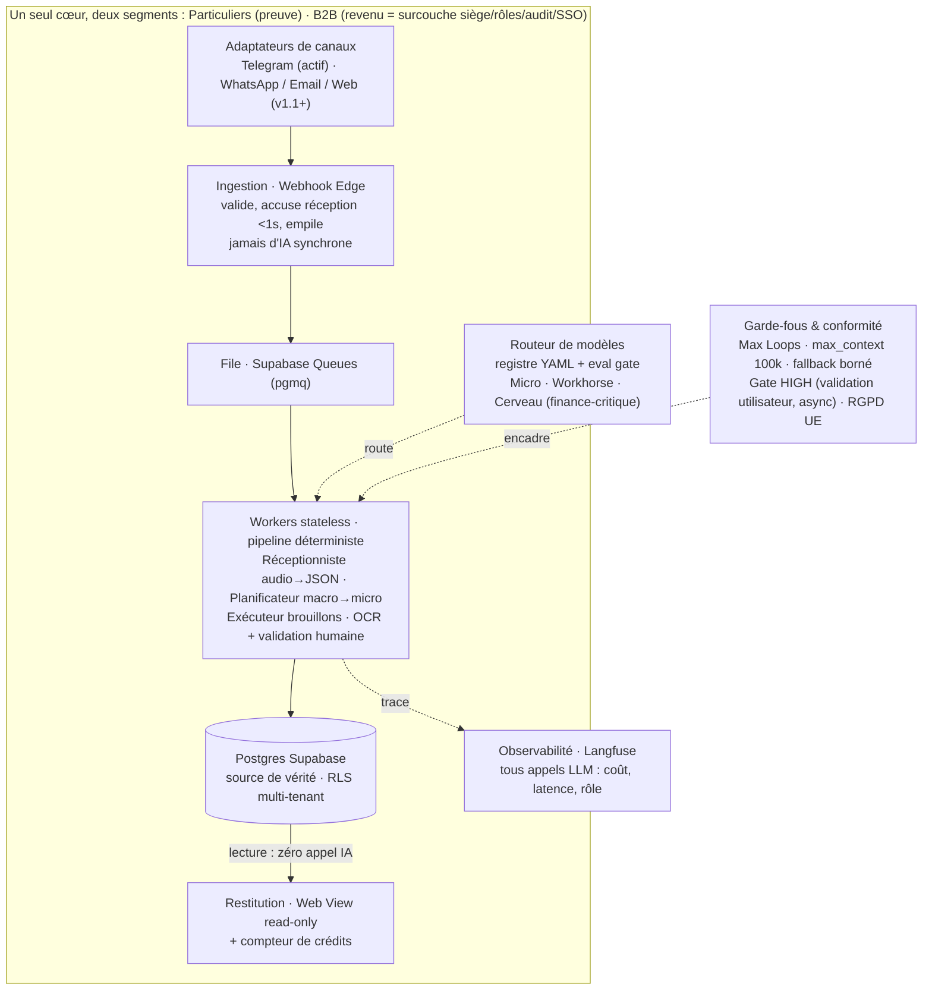

# ADR-001 : Architecture cible Morax

**Statut** : Accepté
**Date** : 30 juin 2026
**Décideur** : Etienne Moreau
**Portée** : produit Morax (assistant admin agentic vendu aux clients). Hors périmètre : plateforme OpenClaw (outillage interne, voir `docs/PLATFORM-AND-TOOLS.md`).
**Complète** : `Morax_MVP_Plan_resserre.md`, `grille-actions-poids.md`, mémoire `project-morax-decisions`.

---

## 1. Contexte

Le plan MVP v2 décrit déjà la bonne fondation (queue pgmq, registre de modèles, Langfuse jour 1, facturation en crédits). La question ouverte n'était pas « quoi construire » mais « quelle forme donne le maximum de scalabilité, de rentabilité et d'efficacité, et où ne pas sur-investir ». Cet ADR fige cette forme cible pour éviter de la rouvrir à chaque session.

Trois contraintes structurantes du contexte :

1. Le revenu réel est en B2B (ordre de grandeur interne, non mesuré : 5 installs B2B pour environ 80 particuliers). Les particuliers servent de preuve.
2. La marge sur le poste LLM est déjà supérieure à 98 %. La vraie contrainte de coût est le temps humain par tenant (onboarding, capture de voix, support), pas les tokens.
3. Le segment ADHD et finance-critique impose une fiabilité non négociable sur les dates et montants, et une validation humaine avant tout effet de bord.

---

## 2. Décision

Adopter **un seul cœur multi-tenant, événementiel et stateless**, et poser au-dessus une fine couche d'adaptateurs (canaux d'entrée et surcouche B2B) plutôt que de construire plusieurs produits.

Flux : ingestion légère (le webhook valide, accuse réception en moins d'une seconde et empile, jamais d'IA synchrone) vers file pgmq, vers workers stateless, vers Postgres comme **source de vérité unique avec un chemin de lecture à zéro appel IA**. Le routage des modèles passe par un registre YAML doublé d'un eval gate Langfuse. La facturation est exprimée en crédits découplés des tokens.

### 2.1 Briques validées (conserver telles quelles)

| Brique | Levier servi | Décision |
|---|---|---|
| Webhook empile, worker traite (Supabase Queues pgmq) | Scalabilité | Conservé. On scale en ajoutant des workers, sans toucher l'ingestion. |
| Routeur via registre YAML, cerveau réservé au finance-critique | Rentabilité | Conservé. Source des marges supérieures à 98 % sur le LLM. |
| Lecture = Supabase seul, zéro appel IA | Efficacité, coût | Conservé. L'usage le plus fréquent (consultation) ne coûte rien. |
| Facturation en crédits, tokens et modèles jamais exposés | Rentabilité commerciale | Conservé. Découple le prix des coûts, rend l'upgrade contextuel. |
| Langfuse dès le jour 1 comme eval gate | Les trois | Conservé. Condition pour baisser un modèle en sécurité et auditer le COGS. |

### 2.2 Décisions de durcissement (la valeur ajoutée de cet ADR)

1. **Optimiser le coût humain par tenant, pas le coût modèle.** À plus de 98 % de marge LLM, raboter encore le coût modèle a une valeur marginale quasi nulle. L'effort d'ingénierie va à l'onboarding self-serve, à la capture automatisée de la voix client (few-shot) et à la déflexion de support. C'est le levier de rentabilité dominant.

2. **Un seul cœur pour particuliers et B2B.** Le B2B n'est pas un produit distinct : c'est le même moteur plus une couche fine (multi-siège, boîte partagée, rôles admin, journal d'audit, SSO ultérieurement). On scale le revenu sans dupliquer le build.

3. **Abstraire le canal d'entrée dès maintenant.** Un adaptateur d'ingestion (interface unique, implémentation Telegram d'abord) est posé tout de suite, même si seul Telegram est livré. Cela évite une réécriture lors de l'ajout de WhatsApp, email ou web, et lève le double piège de Telegram (plafond d'environ 20 Mo, absence des clients B2B).

4. **Pipeline déterministe, pas essaim d'agents.** Une chaîne courte de rôles spécialisés mono-passe (réceptionniste audio vers JSON, planificateur macro vers micro-tâches, exécuteur sur les seuls nœuds nécessaires, OCR avec validation humaine) est plus prévisible, moins chère et plus traçable qu'une boucle d'agents ouverte. Max Loops est un principe, pas un filet.

5. **Live API en option premium, pas par défaut.** L'audio temps réel coûte nettement plus que la transcription batch. Batch par défaut, Live API réservé au tier premium, sinon il érode la marge sur le segment le moins rémunérateur.

6. **Hébergement séparé interne / produit (décision 2026-06-30).** Le produit client tourne exclusivement sur du cloud managé en région UE avec DPA (Vercel, Supabase, Cloudflare R2, Google Cloud Run, Langfuse Cloud). Le NAS OpenClaw reste cantonné à la plateforme interne et ne touche jamais de donnée client. Un NAS domestique n'est ni vendable (pas de DPA, pas d'uptime crédible) ni conforme pour héberger les données financières de tiers, et c'est un bloqueur de vente B2B avant d'être un risque technique.

### 2.3 Garde-fous et conformité (codés d'emblée)

`max_context_tokens_per_call: 100000` (déclenche le retrieval, neutralise la falaise MiniMax). Max Loops par job. Plafond de crédits par tenant. Fallback borné : intra-tier, puis montée de tier plafonnée, puis rejet, jamais de fallback gratuit non borné. Rôles finance-critiques (extraction d'échéance, vérification de montant, contrôle de pénalité) toujours routés sur le cerveau. Gate d'approbation des actions HIGH côté utilisateur final, en validation asynchrone non bloquante, jamais de paiement automatique. RGPD : endpoints région UE, chiffrement des tokens OAuth au repos, table sous-traitants et régions, modèles chinois uniquement via endpoint Western-managed.

---

## 3. Priorité d'effort

Par ordre d'impact réel : (1) onboarding et capture de voix automatisés, (2) surcouche B2B team sur le cœur unique, (3) adaptateur de canal, (4) rétention via le gate d'approbation utilisateur comme feature de confiance. L'optimisation fine des coûts modèle arrive loin derrière.

---

## 4. Conséquences

**Positives.** Scalabilité horizontale par ajout de workers. Marge protégée par le découplage crédits/tokens. Un seul socle à maintenir pour deux segments. Ajout de canaux sans réécriture. Coût de consultation nul. Auditabilité complète via Langfuse.

**Négatives et coûts assumés.** L'abstraction de canal et la couche B2B ajoutent de la complexité avant d'avoir le revenu qui la justifie : à garder mince tant que la bêta n'a pas validé la demande. La validation humaine obligatoire (OCR finance, actions HIGH) introduit une latence et un point de friction à soigner côté UX, surtout pour le public ADHD.

**Risques résiduels.** Coût Live API audio (à bencher). Latence worker sur brain dump long (prévoir un accusé « je traite »). Refresh des tokens OAuth non trivial. Le ratio B2B/particuliers est une hypothèse à valider avant d'en faire un pilier de pricing.

---

## 5. Alternatives rejetées

| Alternative | Raison du rejet |
|---|---|
| IA synchrone dans le webhook | Timeout Edge incompatible avec un brain dump multi-agents. Casse le canal d'ingestion sous charge. |
| Essaim d'agents en boucle ouverte | Coût et latence imprévisibles, traçabilité faible, sur-ingénierie pour ce domaine. |
| Produits séparés particuliers vs B2B | Double maintenance, dérive des deux socles, dilue l'effort. |
| Self-host GPU ou BYO-subscription | Déjà tranché en API-only. Pas de gain de marge réel vu les volumes, surcoût opérationnel élevé. |
| Optimisation agressive des coûts modèle comme priorité | Marge déjà supérieure à 98 %. Effort mal placé face à l'onboarding et au support. |

---

## 6. Diagramme

Schéma haute-fidélité aux couleurs Morax : `docs/architecture-cible-morax.svg`. Version versionnable ci-dessous.

---

## 7. Modèles par rôle

Aucun modèle en dur : tout passe par `models.registry.yaml`. Le tableau ci-dessous donne le défaut par rôle. Prix en USD par million de tokens (entrée / sortie), issus du registre Morax vérifié le 30 juin 2026.

| Rôle | Modèle par défaut | ID API | Tier | Prix in/out | Endpoint |
|---|---|---|---|---|---|
| Réceptionniste (audio temps réel) | Gemini 2.5 Flash Live | `gemini-2.5-flash-live` | premium feature | Live API, à bencher | Google (UE) |
| Transcription / structuration | Gemini 3.5 Flash | `gemini-flash-latest` | workhorse | environ $0.30 / $1.20 | Google (UE) |
| Planificateur TDAH (macro vers micro) | Claude Sonnet 4.6 | `claude-sonnet-4-6` | workhorse | $3 / $15 | Anthropic (UE) |
| Rôles finance-critiques (échéance, montant, pénalité) | Claude Opus 4.8 | `claude-opus-4-8` | cerveau | $5 / $25 | Anthropic (UE) |
| Exécuteur (brouillons, extraction d'entités) | DeepSeek V4-Flash | `deepseek-v4-flash` | micro | $0.14 / $0.28 | OpenRouter (Western-managed) |
| OCR factures / reçus | Gemini 3.5 Flash | `gemini-flash-latest` | workhorse | environ $0.30 / $1.20 | Google (UE) |
| Condensation (v1.1+) | Gemini 3.1 Flash-Lite | `gemini-3.1-flash-lite` | micro | environ $0.10 / $0.40 | Google (UE) |

Alternatives de tier (registre, pour eval gate) : workhorse économique MiniMax M2.5 ($0.30 / $1.20), micro premium Claude Haiku 4.5 ($1 / $5), cerveau intermédiaire Gemini 3.1 Pro ($2 / $12). Règle dure : tout rôle finance-critique reste sur le cerveau quel que soit le palier du tenant.

---

## 8. Hébergement et topologie (produit)

Distinct de la plateforme OpenClaw (NAS interne, réservé à l'outillage et aux données d'Etienne). Le produit client tourne 100 % sur cloud managé, tout le data-at-rest en région UE, chaque sous-traitant couvert par un DPA. Aucune donnée client ne transite ni ne réside sur le NAS domestique.

| Couche | Plateforme | Région / note |
|---|---|---|
| Front Next.js + Webhook Edge | Vercel | région UE |
| Postgres, Auth, Queue pgmq, RLS | Supabase | région UE (Francfort / Londres) |
| Médias (audio, images) | Cloudflare R2 | juridiction UE, egress gratuit |
| Worker de fond (orchestration longue) | Google Cloud Run (Job déclenché par Cloud Scheduler, scale-to-zero) | région UE (europe-west) |
| Observabilité | Langfuse Cloud (Core), DPA + SOC2 / ISO | région UE |
| Email entrant | Postmark ou Mailgun (alias) | UE |
| APIs LLM | Anthropic, Google, OpenRouter | endpoints UE / Western-managed |

RGPD : endpoints UE, chiffrement des tokens OAuth au repos, table sous-traitants et régions, modèles chinois uniquement via endpoint Western-managed. Jamais de donnée finance / visage / email via endpoint chinois direct.

Posture de conformité (pour vendre, surtout en B2B) : séparation stricte plateforme interne (NAS) / produit (cloud managé) ; registre des sous-traitants avec DPA et région pour chacun (Vercel, Supabase, Cloudflare, Google Cloud, Langfuse, Postmark, Anthropic, OpenRouter) ; résidence UE ; chiffrement au repos et en transit ; modèle de DPA fourni aux clients. Certifications visées plus tard si montée en gamme (SOC2 / ISO 27001), pas requises au lancement mais facilitées par le choix de fournisseurs déjà certifiés.

---

## 9. Estimation des coûts

Hypothèses : 1 utilisateur actif = 60 crédits/mois (scénario type de `grille-actions-poids.md`). Change retenu environ £1 = $1.27 (approximatif, non garanti). Prix infra vérifiés en juin 2026.

### 9.1 Coûts de déploiement (fixes par mois)

| Poste | Plateforme | Coût mensuel |
|---|---|---|
| Front + Edge | Vercel Pro (1 seat, $20 de crédit inclus) | $20 |
| Base + Auth + Queue | Supabase Pro (8 GB DB, 100 GB storage, 100k MAU) | $25 |
| Médias | Cloudflare R2 (10 GB gratuits, puis $0.015/GB) | environ $3 |
| Email entrant | Postmark Pro (10k messages, inbound inclus) | $16.50 |
| Worker | Google Cloud Run (UE, scale-to-zero, Job + Scheduler) | environ $5 |
| Observabilité | Langfuse Cloud Core (UE, DPA) | $29 |
| **Total socle** | | **environ $99 / mois (environ £78)** |

Le coût Cloud Run est conservateur : en scale-to-zero à faible volume, le coût réel est proche de $0 et ne monte qu'avec l'usage. Variante d'économie possible plus tard : auto-héberger Langfuse sur le même Cloud Run ou un VPS UE pour retirer les $29, au prix d'un peu d'ops. Telegram Bot API et le domaine Cloudflare sont négligeables. OpenRouter n'a pas de coût fixe (frais de 5,5 % sur les recharges de crédits, intégré au coût variable). Le NAS OpenClaw n'apparaît plus : il est hors du périmètre produit.

### 9.2 Coût variable par utilisateur actif (60 crédits/mois)

| Poste | Coût |
|---|---|
| LLM, tier économique | environ $0.30 |
| LLM, tier premium (cerveau Opus) | environ $1.00 |
| Stockage R2 par utilisateur | négligeable |
| Email entrant par utilisateur | négligeable (1 message inbound = 1 unité Postmark) |
| Frais OpenRouter (+5,5 % sur la part DeepSeek) | quelques centimes |

Le coût variable est dominé par le LLM et reste inférieur à 1 % du prix du plan Base (£25).

### 9.3 Coût total par utilisateur et marge à l'échelle

Socle fixe managé ($99) amorti sur N utilisateurs, plus le variable économique ($0.30). Marge calculée contre le plan Base à £25.

| Utilisateurs | Coût total / utilisateur | Marge brute (plan Base £25) |
|---|---|---|
| 10 | environ £8.1 | environ 68 % |
| 50 | environ £1.8 | environ 93 % |
| 200 | environ £0.6 | environ 97 % |
| 1000 | environ £0.3 | environ 99 % |

Lecture : le passage au tout-managé UE fait monter le socle de $65 à $99, ce qui pèse surtout sous 30 utilisateurs (marge environ 68 % à 10 users) puis devient négligeable (plus de 95 % au-delà d'une centaine d'utilisateurs). Le surcoût de sécurité et de conformité est donc réel mais faible, et il débloque la vente B2B. **Conclusion inchangée et renforcée par la décision 1 : la rentabilité ne se joue pas sur l'infra ni les tokens, mais sur le coût humain par tenant (onboarding, capture de voix, support).**

### 9.4 Limites de l'estimation

Le coût Live API audio n'est pas chiffré (à bencher, risque résiduel connu). Les prix infra sont à la date de juin 2026 et évoluent. Le change GBP/USD est approximatif. Au-delà d'environ 100k MAU ou de gros volumes médias, Supabase, R2 et Postmark passent en facturation à l'usage : à recalibrer sur données réelles Langfuse après 30 jours.

### 9.5 Sources de prix

Modèles : registre Morax (`project-morax-decisions`, vérifié 2026-06). Infra (vérifié juin 2026) : [Vercel](https://vercel.com/pricing), [Supabase](https://supabase.com/pricing), [Cloudflare R2](https://developers.cloudflare.com/r2/pricing/), [Langfuse](https://langfuse.com/pricing), [Postmark](https://postmarkapp.com/pricing), [OpenRouter](https://openrouter.ai/pricing).
